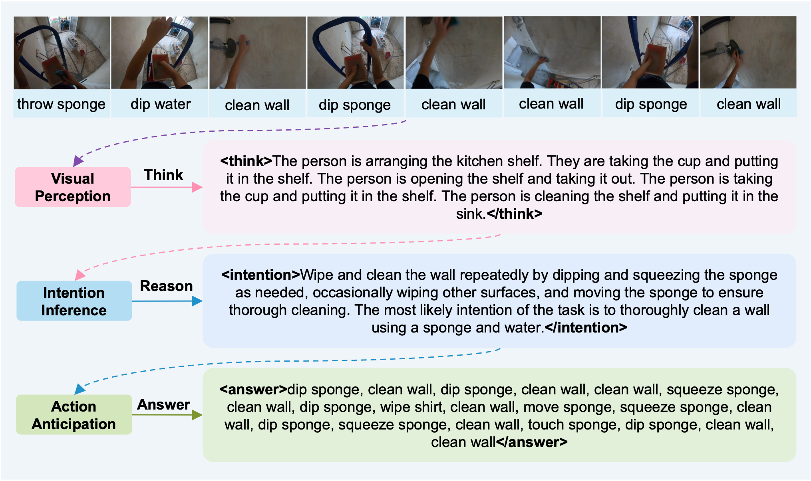
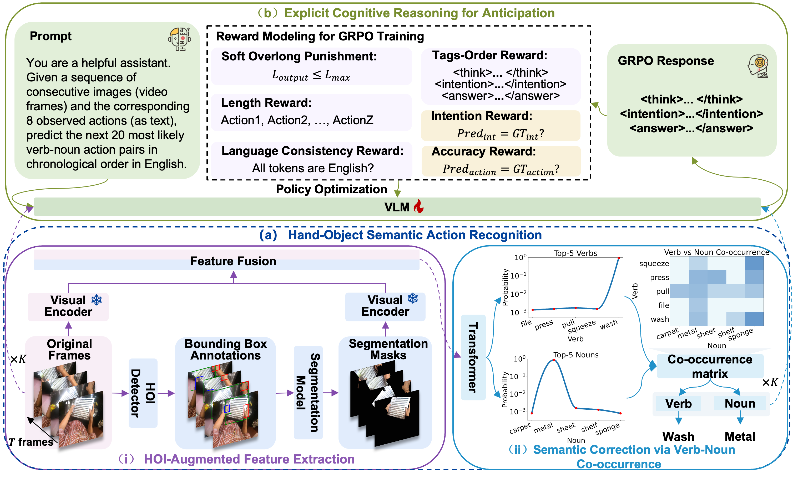
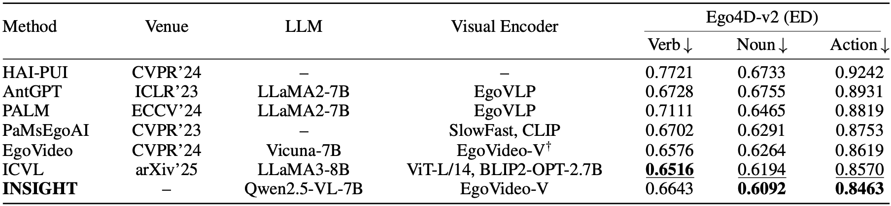
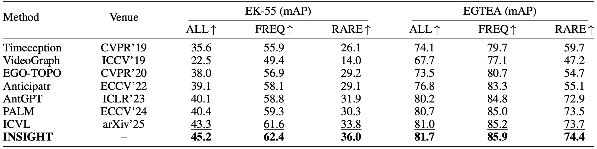
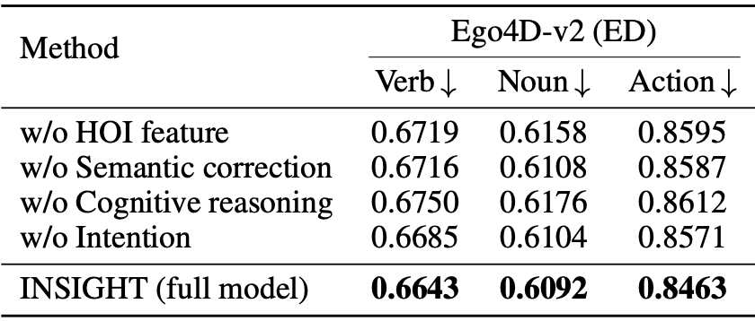
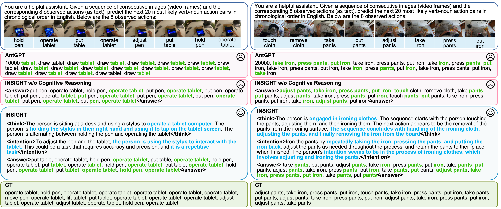

<div align="center">
<h2 align="center">
  <b>Intention-Guided Cognitive Reasoning for Egocentric Long-Term Action Anticipation</b>
</h2>

<div>
Qiaohui Chu<sup>1,2</sup>,
Haoyu Zhang<sup>1,2</sup>,
Meng Liu<sup>3&#9993;</sup>,
Yisen Feng<sup>1</sup>,
Haoxiang Shi<sup>1,2</sup>,
Liqiang Nie<sup>1&#9993;</sup>
</div>

<sup>1</sup>Harbin Institute of Technology (Shenzhen)&nbsp;&nbsp;&nbsp;
<sup>2</sup>Pengcheng Laboratory&nbsp;&nbsp;&nbsp;
<sup>3</sup>Shandong Jianzhu University
<br />
<sup>&#9993;</sup>Corresponding authors
<br/>

<div align="center">
  <a href="https://doi.org/10.1609/aaai.v40i21.38797" target="_blank">
    
  </a>
  <a href="https://arxiv.org/abs/2508.01742" target="_blank">
    
  </a>
</div>
</div>

## 🆕 Updates

- [04/2026] README updated.
- [2026] AAAI paper published: *Intention-Guided Cognitive Reasoning for Egocentric Long-Term Action Anticipation*.
- [11/2025] Official repository released.

## 🚀 Overview



Given observed egocentric video segments, our framework connects perceptual understanding and cognitive reasoning to achieve long-term future action prediction:

**Perception (think) → Intention Inference (reason) → Action Prediction (answer)**

INSIGHT is a unified two-stage framework for egocentric long-term action anticipation:

- **Stage 1:** Hand-Object Semantic Action Recognition
- **Stage 2:** Explicit Cognitive Reasoning for Anticipation

## 🧩 Project Structure

```bash
.
├── HandObject/
├── CognitiveReasoning/
└── assets/
```

The `HandObject` and `CognitiveReasoning` modules have their own detailed README files and scripts for training and evaluation.

## 🛠️ Installation

### 1. Create Environment

```bash
conda create -n your_env python=3.10 pip -y
conda activate your_env
```

### 2. Install PyTorch (CUDA 12.4)

```bash
conda install -y pytorch==2.5.1 torchvision==0.20.1 torchaudio==2.5.1 pytorch-cuda=12.4 -c pytorch -c nvidia
```

For CPU-only users:

```bash
conda install -y pytorch torchvision torchaudio cpuonly -c pytorch
```

### 3. Install Dependencies

```bash
git clone https://github.com/modelscope/ms-swift.git
cd ms-swift && pip install -e .
pip install deepspeed flash-attn --no-build-isolation
pip install -r requirements.txt
```

If you encounter:

```bash
ImportError: libGL.so.1: cannot open shared object file
```

fix it with:

```bash
sudo apt-get update && sudo apt-get install -y ffmpeg libsm6 libxext6
```

### 4. Verify

```bash
python -c "import torch; print(torch.__version__, torch.cuda.is_available())"
```

## 🎯 Pretrained Models

Download and store all pretrained weights under:

```bash
/pretrain_model/
  ├── EgoVideo/
  ├── all-MiniLM-L6-v2/
  ├── SAM2/
  ├── Hand Object Detector/
  └── Qwen2.5-VL/
```

## 📂 Data Preparation

### 1. Datasets

This project supports:

- **Ego4D**
- **EPIC-Kitchens-55**
- **EGTEA Gaze+**

Please follow the official dataset download instructions and organize the files under `./data`.

### 2. Feature Extraction

Run **Hand Object Detector**, **SAM2**, and **EgoVideo** in sequence, following their official tutorials, to obtain both:

- **frame features**
- **HOI (hand-object interaction) features**

## 🧩 Framework



INSIGHT is a two-stage framework for egocentric long-term action anticipation:

### Stage 1: Hand-Object Semantic Action Recognition

This stage extracts semantically rich visual features from hand-object interaction regions and enhances action representations with semantic verb-noun co-occurrence modeling.

### Stage 2: Explicit Cognitive Reasoning for Anticipation

This stage fine-tunes a vision-language model with GRPO-based reinforcement learning to perform structured cognitive reasoning through:

- **visual perception** (`think`)
- **intention inference** (`reason`)
- **action anticipation** (`answer`)

## 🚀 Running the Pipeline

### Stage 1 - Hand-Object Semantic Action Recognition

This stage extracts and fuses HOI and frame features.

See `HandObject/README.md` for training and testing details.

### Stage 2 - Explicit Cognitive Reasoning for Anticipation

This stage fine-tunes **Qwen2.5-VL-7B** with **GRPO reinforcement learning**.

See `CognitiveReasoning/README.md` for detailed instructions.

## 😺 Evaluation Results

### Main Results on Ego4D



### Main Results on EPIC-Kitchens-55 and EGTEA Gaze+



### Ablation Study



### Qualitative Comparison



## 🙏 Acknowledgements

We thank the authors of **[Ego4D](https://ego4d-data.org/)**, **[EPIC-Kitchens-55](https://epic-kitchens.github.io/2025)**, and **[EGTEA Gaze+](https://cbs.ic.gatech.edu/fpv/)** for providing the open-source datasets that support our experiments.

We also thank the developers of **[Hand Object Detector](https://github.com/ddshan/hand_object_detector)**, **[SAM2](https://github.com/facebookresearch/sam2)**, and **[EgoVideo](https://github.com/OpenGVLab/EgoVideo)** for their released pretrained models and codebases.

Finally, we acknowledge the **[ms-swift](https://github.com/modelscope/ms-swift)** framework for enabling efficient GRPO-based reinforcement learning in our cognitive reasoning module.

We also invite readers to check out our challenge report, which achieved **1st place** in the *Long-Term Action Anticipation, Ego4D Challenge @ CVPR 2025*:

🔗 [Technical Report for Ego4D Long-Term Action Anticipation Challenge 2025](https://arxiv.org/abs/2506.02550)

## 🤗 Citation

If you find this work useful for your research, please consider citing:

```bibtex
@inproceedings{chu2026insight,
  title={Intention-Guided Cognitive Reasoning for Egocentric Long-Term Action Anticipation},
  author={Chu, Qiaohui and Zhang, Haoyu and Liu, Meng and Feng, Yisen and Shi, Haoxiang and Nie, Liqiang},
  booktitle={Proceedings of the AAAI Conference on Artificial Intelligence},
  volume={40},
  number={21},
  pages={17436--17444},
  year={2026},
  doi={10.1609/aaai.v40i21.38797}
}
```

## 🔖 License

This project is released under the [MIT License](./LICENSE).
